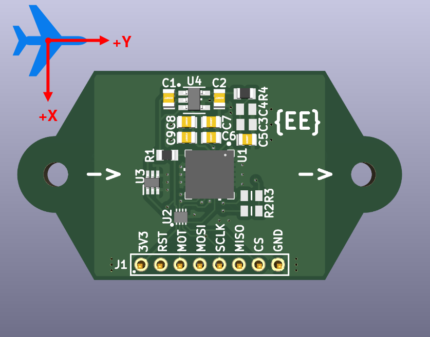

# EngEmil PMW3901MB ChibiOS DRIVER

Version: `1.0.0`

EngEmil PMW3901MB ChibiOS Driver is developed with the [EngEmil PMW3901mB Optical Flow Sensor Module](https://github.com/engemil/engemil_pmw3901mb_hardware) in mind. Written in C with C++ wrap.

The driver is divided into two parts the core (driver) and platform:
- Core
    - `src/ee_pmw3901mb_driver.c`
    - `include/ee_pmw3901mb_driver.h`
- Platform
    - `src/ee_pmw3901mb_platform.c`
    - `include/ee_pmw3901mb_platform.h`

The separation is to make it easier to see where platform specific functions needs to be replaced.

## Module Orientation

The polarity of the X- and Y-axes are related to the reading when the module is attached to a moving object. Indicating which direction the moving object will love to read a positive or negative value of the axes.

## Generate Documentation

Documentation is generated by doxygen. Run doxygen from root folder to generate it: `doxygen doxygen.config`

Documentation can be opened with a web browser with the `index.html` file, generated under the `docs/doxygen/html/`-folder.

## A Note from The Developer

The PixArt PMW3901MB chip has limited documentation, resulting in many drivers and libraries including "magical" writing to the register for undocumented functionalities. The driver can possibly be expanded upon to include all these funcitonalities and build it into a complete driver. However, that would be beyond the scope of my goal for this project, and I would encourage anyone who sees this to build upon it or to use as reference for their own development.

Nonetheless, I do hope this will come of use for someone, and for you I wish you good luck!

## Useful links and resources

- https://wiki.bitcraze.io/_media/projects:crazyflie2:expansionboards:pot0189-pmw3901mb-txqt-ds-r1.00-200317_20170331160807_public.pdf 
- https://github.com/bitcraze/Bitcraze_PMW3901
- https://os.mbed.com/components/PMW3901MB-Far-Field-Optical-Motion-Track/
- https://github.com/libdriver/pmw3901mb
- https://docs.px4.io/main/en/sensor/pmw3901.html
- https://github.com/PX4/PX4-Autopilot/tree/main/src/drivers/optical_flow/pmw3901

