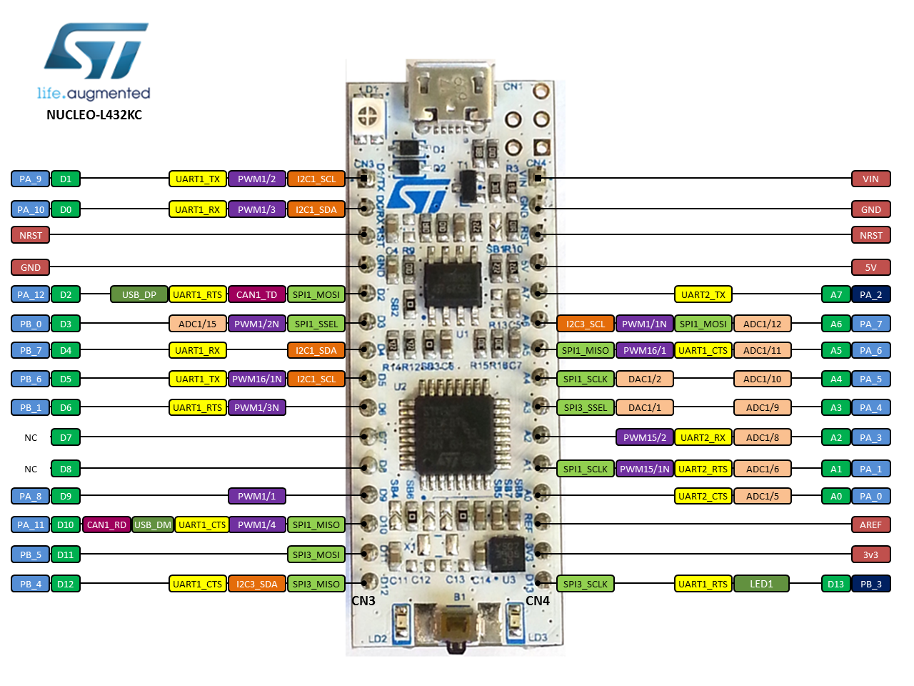

# Example with NUCLEO-L432KC (STM32L432KC) board

This example is with the STM32 Nucleo32 Nucleo-L432KC (STM32L432KC) board.

## HOW-TO Use Example Code

- Overwrite the `ChibiOS`-folder with the ChibiOS repository.
- Move the driver code (`src`- and `include`-folders) into to the `libs`-folder.
- No changes to the `Makefile`. It is already predefined for `libs`-folder and the `libs.mk`-file.
- It is now ready to be compiled and loaded onto a Nucleo-l432KC board.

## NUCLEO-L432KC Pinout

## Wiring EngEmil PMW3901MB Module to the NUCLEO-L432KC board

| PMW3901MB Module Pin | STM32L32KC Pin | NUCLEO-L432KC Arduino Connector Pin | Function |
| --- | --- | --- | --- |
| 3V3 | - | 3V3 | 3.3V power source |
| RST | PA1 | `LINE_ARD_A1` | Reset pin (input) |
| MOT | PA3 | `LINE_ARD_A2` | Motion Interrupt (output) |
| MOSI | PA7 | `LINE_ARD_A6` | SPI MOSI (Master Out Slave In) |
| SCLK | PA5 | `LINE_ARD_A4` | SPI SCLK (Serial Clock) |
| MISO | PA6 | `LINE_ARD_A5` | SPI MOSI (Master Out Slave In) |
| CS | PA4 | `LINE_ARD_A3` | SPI CS (Chip Select) |
| GND | GND | - | Ground |

(insert image of wiring)

## Additional

- Remember to set float support (`CHPRINTF_USE_FLOAT`) to TRUE in `ChibiOS/os/hal/lib/streams/chprintf.h`

## Useful Links

- NUCLEO-L432KC Board: https://www.st.com/en/evaluation-tools/nucleo-l432kc.html
- STM32L432KC Chip: https://www.st.com/en/microcontrollers-microprocessors/stm32l432kc.html
- STM32L4 series SVD files: https://www.st.com/en/microcontrollers-microprocessors/stm32-ultra-low-power-mcus.html#cad-resources
- ChibiOS Demo for the board: https://github.com/ChibiOS/ChibiOS/tree/master/demos/STM32/RT-STM32L432KC-NUCLEO32
- Nucleo-L432KC chibios board file: https://github.com/ChibiOS/ChibiOS/blob/master/os/hal/boards/ST_NUCLEO32_L432KC/board.h
